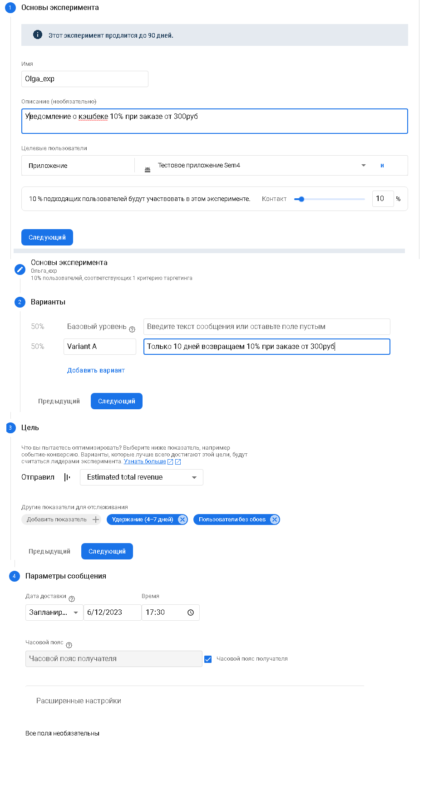
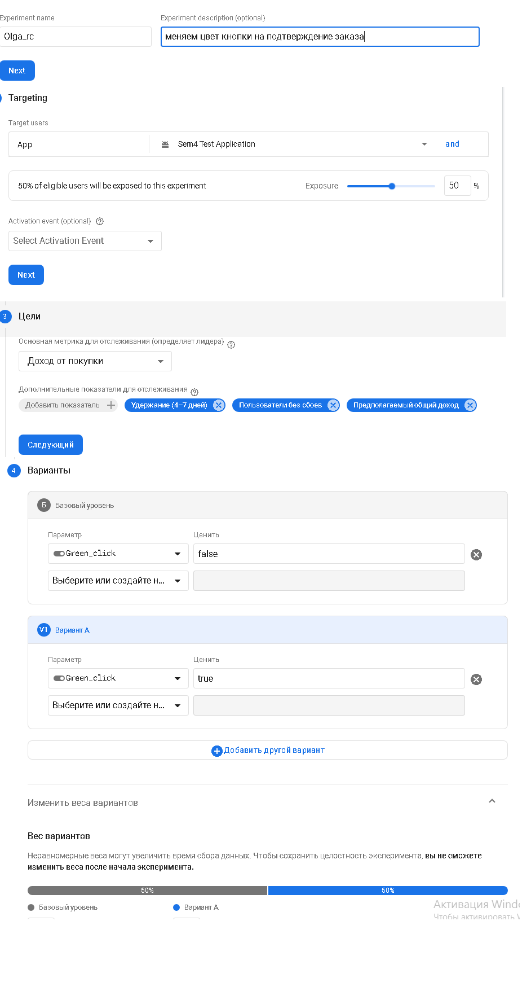
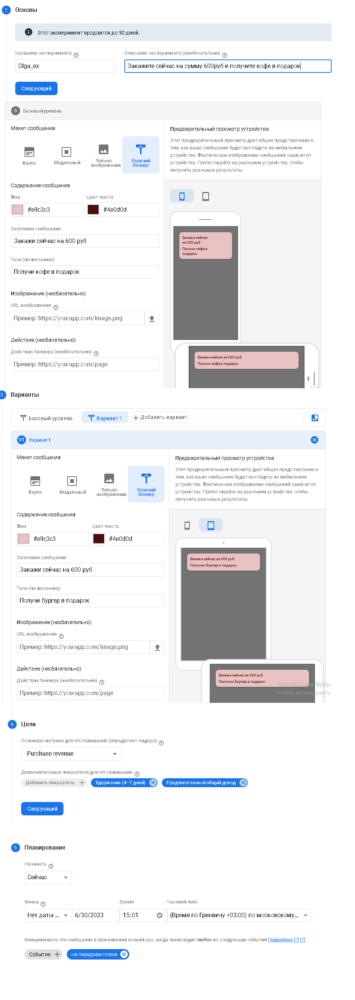
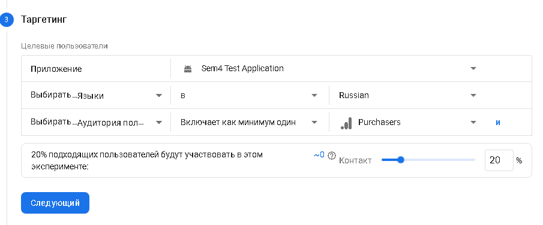

## Настроить а/б тест на мобильной версии (через google optimiza) сайта или взять любое из приложений с вашего телефона (соц. сети, каршеринг, игры, музыка, еда и т.д.) и придумать гипотетические 2-3 аб-теста.
На примере мобильного приложения Бургер Кинг.
- _АВ тест для **Notifications**_: пользователю приходят уведомления о кешбэке в размере 10% при заказе от 300руб. Тестирование проводится на 10% всех пользователей. Устанавливается время проведения эксперимента в зависимости от часового пояса получателя

- _АВ тест для **RemoteConfig**_:меняем цвет кнопки заказа, отслеживаем предполагаемый общий доход и доход от заказаБ проводим на 50% пользователей

- _АВ тест для **Inn-App**_:во время использования приложения пользователь получает сообщения либо о бесплатном кофе при заказе от 600руб, либо о бесплатном бургере при заказе от 600руб, отслеживаем предполагаемый общий доход, проводим на 20% пользователей, русскоязычных, которые являются покупателями

